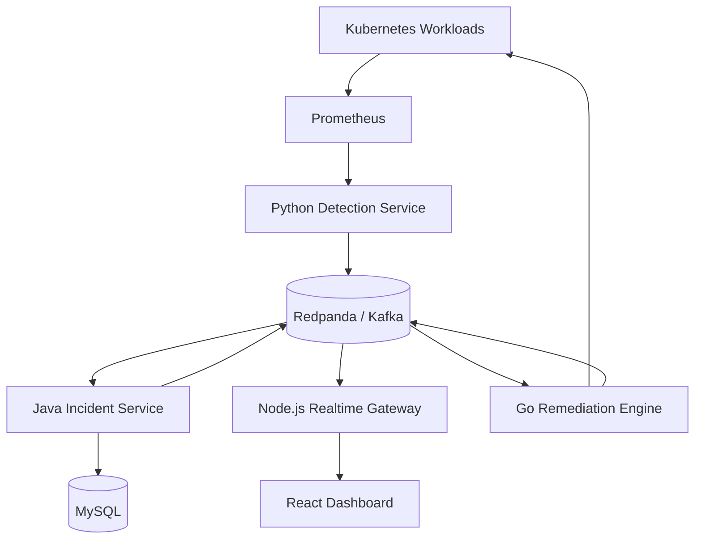

# AegisOps System Architecture

## Purpose

AegisOps is an event-driven reliability platform for Kubernetes workloads.
This document separates what is **currently implemented** from the
**target architecture** the project is being built toward, so a reader can
tell the two apart at a glance.

## Implementation Status

| Component | Status | Notes |
|---|---|---|
| Go cluster agent | Complete | CrashLoopBackOff detection only |
| Java incident service | Complete | REST API, MySQL persistence, transactional outbox |
| MySQL persistence | Complete | `incidents` and `incident_outbox_events` tables |
| Kafka event publishing | Complete | Single topic, two event types |
| Node.js realtime gateway | Complete | Kafka consumer, WebSocket broadcast |
| React dashboard | Complete (read-only foundation) | REST snapshot + WebSocket live updates; no auth or mutation controls |
| Incident-service CORS | Complete | Single configurable allowed origin, for the local dashboard dev server |
| Incident-service container image | Complete | Multi-stage, non-root, JRE-only runtime - see **Container Packaging** below |
| Dashboard container image | Complete | Multi-stage, non-root nginx runtime, same-origin API/WS reverse proxy |
| Realtime-gateway, cluster-agent container images | Complete | Multi-stage, non-root runtimes |
| Kubernetes manifests (local kind) | Complete | Kustomize base + kind-local overlay - see **Kubernetes Deployment** below |
| Prometheus metrics (all three backend services) | Complete | See **Kubernetes Deployment** below and `docs/observability.md` |
| Local-dev Prometheus deployment + alert rules | Complete | Non-persistent, no Alertmanager - see **Kubernetes Deployment** below |
| Automated kind end-to-end test + CI | Complete | `infrastructure/scripts/e2e-kind.ps1`, `.github/workflows/e2e-kind-ci.yml` |
| Acknowledge / resolve endpoints | Planned | Status changes currently go through one generic `PATCH` |
| Remediation request endpoint | Planned | No remediation engine exists yet |
| Services endpoint | Planned | No `services` table exists yet |
| Python detection service | Planned | No metrics-driven anomaly detection exists yet |
| Go remediation engine | Planned | No automated or approved remediation exists yet |
| Grafana / Alertmanager | Planned | Prometheus itself is complete; visualization and external alert delivery are not |
| Retry topics / dead-letter topics | Planned | Only direct at-least-once delivery exists today |
| Distributed tracing | Planned | No trace propagation exists yet |
| Helm / Terraform / AWS deployment | Planned | Local kind deployment via Kustomize exists today; no chart or cloud deployment yet |

---

## Current System

Everything in this section describes code that exists and runs today.

### Implemented Event Flow

```text
Kubernetes workload failure
    -> Go cluster agent
        -> Java incident service REST API
            -> MySQL incidents and transactional outbox
                -> Kafka topic aegisops.incident.events.v1
                    -> Node.js realtime gateway
                        -> WebSocket clients (compact change notification)
                            -> GET /api/v1/incidents/{incidentId}
                                -> React dashboard (apps/dashboard)
```

The WebSocket notification only ever triggers a REST fetch of the complete
incident - it never supplies displayable fields itself. The dashboard also
calls the incident service's REST API directly for its initial snapshot
(`GET /api/v1/incidents` on page load) and again after any WebSocket
reconnection. See **Current Dashboard Behavior** below.

### Current Components

| Component | Technology | Responsibility | Port |
|---|---|---|---:|
| Cluster agent | Go | Detects `CrashLoopBackOff` and reports incidents | n/a (in-cluster watcher) |
| Incident service | Java 21, Spring Boot 4 | Incident lifecycle, REST API, persistence, event publishing | 8080 |
| Realtime gateway | Node.js 22, Fastify, WebSockets | Consumes Kafka, broadcasts to WebSocket clients | 8081 |
| Dashboard | React 19, TypeScript, Vite | Read-only incident visualization | 5173 |
| Database | MySQL 8.4 | Incident and outbox storage | 3306 (mapped to 3307 locally) |
| Event broker | Apache Kafka | Incident event transport | 9092 |

### Current REST API

Owned by the incident service (see
`services/incident-service/README.md`):

| Method | Endpoint | Purpose |
|---|---|---|
| `POST` | `/api/v1/incidents` | Create an incident |
| `GET` | `/api/v1/incidents` | List incidents |
| `GET` | `/api/v1/incidents/{incidentId}` | Retrieve an incident |
| `PATCH` | `/api/v1/incidents/{incidentId}/status` | Update incident status |
| `GET` | `/actuator/health` | Service health check |
| `GET` | `/actuator/prometheus` | Prometheus metrics (see **Observability** under **Kubernetes Deployment**) |

Cross-origin browser requests to `/api/v1/**` are allowed only from the
single origin configured by `AEGISOPS_CORS_ALLOWED_ORIGIN` (defaults to
`http://localhost:5173`, the local dashboard dev server) — not a wildcard.

The realtime gateway exposes:

| Endpoint | Protocol | Purpose |
|---|---|---|
| `/ws/incidents` | WebSocket | Incident lifecycle event stream |
| `/health` | HTTP | Service health check |
| `/metrics` | HTTP | Prometheus metrics |

The cluster agent, previously a pure background watcher with no HTTP
surface, now exposes `/healthz`, `/readyz`, and `/metrics` on port 9090
(see **Observability** under **Kubernetes Deployment**).

#### Planned REST additions (not implemented)

These do not exist in `IncidentController` today. Status changes currently
go through the single `PATCH /api/v1/incidents/{incidentId}/status`
endpoint above.

| Method | Endpoint | Purpose |
|---|---|---|
| `POST` | `/api/v1/incidents/{id}/acknowledge` | Dedicated acknowledge action |
| `POST` | `/api/v1/incidents/{id}/resolve` | Dedicated resolve action |
| `POST` | `/api/v1/incidents/{id}/remediations` | Request remediation |
| `GET` | `/api/v1/services` | List monitored services |

### Current Event Contract

Topic: `aegisops.incident.events.v1`

The incident ID is the Kafka message key, which preserves ordering for a
given incident within a partition.

Current event types:

- `INCIDENT_CREATED`
- `INCIDENT_STATUS_CHANGED`

The current schema (version `1`) is flat. Every event contains exactly:

- `eventId`
- `eventType`
- `eventVersion`
- `occurredAt`
- `incidentId`
- `serviceName`
- `severity`
- `status`
- `previousStatus`

There is no `correlationId`, no `source`, and no nested `payload` in the
current schema. The event does **not** carry `title`, `description`,
`createdAt`, or `updatedAt` — see **Current Dashboard Behavior** below.

### Current Persistence

Verified against the Flyway migrations in
`services/incident-service/src/main/resources/db/migration`. Only two
tables exist today:

| Table | Purpose |
|---|---|
| `incidents` | Incident records (id, service name, title, description, severity, status, timestamps) |
| `incident_outbox_events` | Transactional outbox: pending/published events awaiting Kafka delivery |

`services`, `incident_events`, `remediation_actions`, and `audit_logs` are
**not** current tables. Only the incident service accesses MySQL directly.

### Current Reliability Behavior

- Incident writes and their outbox event are committed in the same MySQL
  transaction (the transactional outbox pattern).
- Kafka delivery is at-least-once: a scheduled publisher retries any event
  still `PENDING`, so the same event can be published more than once.
- The incident ID is used as the Kafka message key.
- The realtime gateway validates every incoming Kafka message against the
  version-1 schema and silently drops anything invalid.
- Because delivery is at-least-once, any consumer of the event stream must
  deduplicate using `eventId` — the dashboard does this (see below).
- The incident service accepts cross-origin REST calls from exactly one
  configured origin (`AEGISOPS_CORS_ALLOWED_ORIGIN`), not a wildcard.
- Health endpoints exist for all three backend services - the incident
  service (`/actuator/health`), the realtime gateway (`/health`), and the
  cluster agent (`/healthz`, `/readyz`) - and all three also expose
  Prometheus metrics (see **Observability** under **Kubernetes
  Deployment**).

#### Planned reliability work (not implemented)

- Retry topics and dead-letter topics for events that repeatedly fail to
  publish or process.
- Distributed tracing across HTTP and Kafka boundaries.
- Remediation approval policies, bounded retries, and timeouts.
- Immutable audit records for remediation attempts.

### Current Dashboard Behavior

`apps/dashboard` (React, TypeScript, Vite) is implemented as a read-only
foundation milestone: no authentication and no incident mutation controls
(acknowledge/resolve) yet. REST supplies every complete incident
representation; the WebSocket supplies only compact **change
notifications** that trigger a REST fetch - the dashboard does not assume
exactly-once delivery of anything, and instead continuously reconciles
toward the incident service as the source of truth.

**Normal path:**

1. Load the initial incident snapshot from `GET /api/v1/incidents` on page
   load. WebSocket notifications that arrive before this succeeds are
   buffered (bounded to 500 entries, deduplicated by `eventId`) and
   replayed afterward, rather than processed immediately or dropped.
2. For every valid, not-yet-processed `INCIDENT_CREATED` or
   `INCIDENT_STATUS_CHANGED` notification, fetch the complete incident via
   `GET /api/v1/incidents/{incidentId}` and upsert that REST response into
   state - for both event types, and regardless of whether the incident
   was already present. Nothing from the notification's own fields
   (`serviceName`, `severity`, `status`, ...) is ever written into
   dashboard state directly.
3. A notification is marked processed (added to a capped 1,000-entry
   `eventId` cache) only once its incident has actually been hydrated and
   applied - never before, and never for one whose hydration failed.
4. A failed detail fetch retries up to 3 times with capped backoff. A
   duplicate or redelivered notification for an `eventId` already
   processed, or still being hydrated, is ignored; at most one detail
   fetch is in flight per `eventId`.

**Fallback path - reconciliation:** one coalesced, bounded-retry mechanism
recovers state whenever the normal path alone cannot be trusted to:

- a detail hydration exhausts its 3 retries,
- the startup buffer overflows its cap, or
- the WebSocket reconnects after a disconnection (not the first
  connection).

Any of these re-fetches `GET /api/v1/incidents` and merges it into state
incident-by-incident. Concurrent triggers - for example a reconnect and a
hydration failure happening together - share one in-flight refresh rather
than each starting a separate request. The refresh itself retries up to 3
times with capped backoff; if every attempt fails, a non-fatal warning
appears in the dashboard with a manual retry action, and a later
successful refresh (automatic or manual) clears it. A single failed live
update, or one exhausted refresh cycle, never blanks the already-loaded
dashboard.

**Timestamp safety:** every incident written into state (via hydration or
a reconciliation merge) has its `updatedAt` compared against whatever is
already there. A strictly newer value replaces it, a strictly older value
is discarded, and an **equal** value also retains the existing one -
network arrival order never decides the winner.

Connection state is surfaced as connecting / live / reconnecting /
disconnected, with capped exponential reconnect backoff (1s, 2s, 4s, ...
capped at 30s).

See `apps/dashboard/README.md` for the full implementation notes.

### Container Packaging

Both the incident service and the dashboard have production-oriented,
multi-stage Dockerfiles - `services/incident-service/Dockerfile` and
`apps/dashboard/Dockerfile`. Both:

- build in one stage and ship only the compiled artifact (a jar; a static
  `dist/` bundle) in a separate, minimal runtime stage,
- run as a dedicated non-root user,
- declare a container `HEALTHCHECK` against the health endpoint already
  documented above,
- use an exec-form entrypoint so the process receives `SIGTERM` directly
  for graceful shutdown, and
- pin exact base-image versions - no floating `latest` tags.

Neither image hardcodes environment-specific configuration. The incident
service keeps environment variables as its only runtime-configuration
mechanism (see **Current REST API** above); nothing changed there. The
dashboard's static bundle cannot read environment variables at
runtime (Vite's `VITE_*` variables are compiled in), so instead its
container runs nginx configured to reverse-proxy `/api/*` and
`/ws/incidents` to upstream services named by environment variables
resolved at container start - the browser only ever calls the
dashboard's own origin, never a backend container name directly. See
`apps/dashboard/README.md`'s **Container Image** section for the exact
routes and variables.

`infrastructure/local/compose.yaml` can build and run all three
containerized services (incident service, realtime gateway, dashboard)
alongside MySQL and Kafka on one Docker network, in addition to its
original role of just providing MySQL/Kafka for natively-run services.

This was originally a container-packaging-only milestone; Kubernetes
manifests that deploy these images are now complete - see **Kubernetes
Deployment** immediately below.

## Kubernetes Deployment (kind)

Local-development-only. Every workload below runs as a single instance
with no cross-node HA, and is not a template for a production
deployment - see **Local-Dev Limitations** at the end of this section.

### Topology

```text
cluster-agent
    -> incident-service:8080
        -> mysql:3306
        -> kafka:9092

kafka:9092
    -> realtime-gateway:8081

dashboard:8080
    -> incident-service:8080 through /api
    -> realtime-gateway:8081 through /ws/incidents
```

Only the dashboard needs to be reachable from a browser, via
`kubectl port-forward`; nothing else has an externally exposed listener.
All in-cluster hostnames above are Kubernetes Service DNS names within
the `aegisops-system` namespace.

### Kustomize Structure

`infrastructure/kubernetes/base/` holds one directory per component -
reusable, environment-agnostic manifests. `overlays/kind-local/` composes
those bases into four staged Kustomizations, applied in dependency order:

1. `00-namespace` - the `aegisops-system` Namespace (Pod Security
   `restricted` labels) and, via the deploy script, the Secret.
2. `10-infrastructure` - MySQL and Kafka StatefulSets.
3. `20-kafka-topic-init` - a Job that idempotently creates
   `aegisops.incident.events.v1` once Kafka is reachable.
4. `30-application` - incident-service, realtime-gateway, dashboard, and
   cluster-agent.

`base/namespace/` and `base/cluster-agent/` hold the Namespace, RBAC, and
Deployment manifests that were previously under
`services/cluster-agent/deploy/kubernetes/` - relocated (not duplicated)
into this tree because `kubectl kustomize`'s default load restrictor
refuses to reference files outside a Kustomization's own directory tree.
`base/cluster-agent/patch-incident-service-url.yaml` is the only change
from the original manifest: it repoints `AEGISOPS_INCIDENT_SERVICE_URL`
from `http://host.docker.internal:8080` (agent running on the Docker
Desktop host) to `http://incident-service:8080` (agent running in-cluster
alongside it). RBAC is untouched - still `get`/`list`/`watch` on Pods
only.

See [`README.md`](../README.md#kubernetes-deployment-kind) for the actual
deploy/verify commands and directory listing.

### MySQL and Kafka

Both are dev-only, single-instance StatefulSets with a headless governing
Service for stable DNS (`mysql`, `kafka`) and a `PersistentVolumeClaim`
per instance on kind's default `standard` (`rancher.io/local-path`)
StorageClass - not replicated, not highly available, and not backed up.
MySQL is `mysql:8.4` and Kafka is `apache/kafka:4.3.1`, matching the
versions pinned in `infrastructure/local/compose.yaml`.

Kafka runs in KRaft mode (no ZooKeeper) as a single node acting as both
broker and controller, with `KAFKA_AUTO_CREATE_TOPICS_ENABLE=false` - the
`kafka-topic-init` Job is the only thing that creates topics, with
`--if-not-exists` so re-running it is a no-op once the topic exists. Its
readiness and liveness probes deliberately use a plain TCP check on the
broker port rather than `kafka-topics.sh --list`: that CLI launches its
own JVM per invocation, which was observed to make the broker flap under
ordinary local scheduling jitter even with no real resource pressure on
the node. The startup probe still uses the heavier `kafka-topics.sh`
check, since it is the one place a real functional check belongs -
gating first readiness once, not running every 10-20 seconds
indefinitely.

### Security Posture

Every pod in this deployment runs under the namespace's Pod Security
`restricted` profile:

- non-root, with an explicit `runAsUser`/`runAsGroup` matched to each
  image's actual non-root user (verified via `docker run --entrypoint id`
  against each image, since Kubernetes cannot verify `runAsNonRoot` for an
  image whose `USER` is a non-numeric name without an explicit UID - this
  is what originally broke the Kafka StatefulSet during initial rollout),
- `allowPrivilegeEscalation: false` and all Linux capabilities dropped,
- `seccompProfile: RuntimeDefault`,
- a read-only root filesystem with a scratch `emptyDir` at `/tmp` (and,
  for the dashboard, a second `emptyDir` at `/etc/nginx/conf.d` for
  envsubst's rendered config) wherever the base image supports it - MySQL
  is the one exception, since its official entrypoint writes broadly
  across the root filesystem in ways not worth fighting for a dev-only
  database,
- `automountServiceAccountToken: false` everywhere except cluster-agent,
  the only workload that calls the Kubernetes API.

### Observability

All three backend services expose Prometheus-formatted metrics: the
incident service via Spring Boot Actuator + Micrometer at
`/actuator/prometheus` (alongside its existing REST API on port 8080,
gated by `management.endpoints.web.exposure.include=health,prometheus` -
no other Actuator endpoint, including `env`, is exposed), the realtime
gateway via `@prometheus-io/client` at `/metrics` (port 8081, alongside
`/health`), and the cluster agent via a small dedicated HTTP server
(`internal/observability`) exposing `/healthz`, `/readyz`, and `/metrics`
on port 9090 - its only HTTP surface, since the agent otherwise has none.
`/readyz` reflects whether the agent's Kubernetes informer cache has
actually synced, not just that the process started.

A single-instance Prometheus (`base/prometheus`, stage
`40-observability`) scrapes all three via static in-cluster targets - no
Kubernetes service discovery, so it needs no ServiceAccount token. Every
custom counter uses small, bounded label sets (container type, outcome,
event type - never a pod name, incident ID, or error message) and is
pre-registered at zero for every known label combination at startup, so
each is visible on the very first scrape rather than only after the
corresponding event first occurs. Full metric reference, PromQL examples,
and the four local alert rules (evaluated by Prometheus itself; there is
no Alertmanager) are in
[`docs/observability.md`](../docs/observability.md).

`infrastructure/scripts/e2e-kind.ps1` (PowerShell Core, so it runs
unmodified on Windows locally and on the Ubuntu GitHub Actions runner in
[`.github/workflows/e2e-kind-ci.yml`](../.github/workflows/e2e-kind-ci.yml))
exercises the full detection-to-dashboard path deterministically: it
opens a WebSocket on the dashboard's `/ws/incidents` route *before*
creating a uniquely-named `CrashLoopBackOff` pod, waits for genuine
detection, and cross-checks the WebSocket notification's incident ID
against the one returned by the REST API - bounded polling throughout,
no fixed sleeps as the synchronization mechanism. The CI workflow
generates ephemeral, masked, CI-only database credentials at runtime
(never a repository secret), creates and always tears down its own kind
cluster, and never publishes an image.

### Local-Dev Limitations

- MySQL and Kafka are single instances - no replication, no failover, no
  automated backups.
- No ingress controller: only the dashboard is reachable from a browser,
  via `kubectl port-forward`, by design for this milestone.
- No image registry: all four `:dev` images are built locally and loaded
  directly into kind with `kind load docker-image`.
- No Helm chart, no multi-environment overlay beyond `kind-local`, and no
  cloud deployment - see **Target Architecture** below for what a
  production deployment would still need.
- Prometheus data lives on an `emptyDir` with 6-hour retention - not
  persistent across a pod restart, and no Alertmanager or Grafana (see
  **Observability** above and `docs/observability.md`).

---

## Target Architecture (Roadmap)

Everything below describes where the project is heading, not what exists
today. Components and behavior in this section are not implemented unless
also listed under **Current System** above.

### MVP Scenario

1. A Kubernetes workload becomes unhealthy.
2. Prometheus records abnormal metrics.
3. The detection service identifies the anomaly.
4. An incident is created and displayed on the dashboard.
5. An operator approves a remediation action.
6. The remediation engine restarts, scales or rolls back the workload.
7. The result is recorded in the incident audit trail.

### Target System Overview



### Target Components

| Component | Technology | Responsibility | Port |
|---|---|---|---:|
| Dashboard | React and TypeScript | Incident visualization; operator controls are a future milestone | 5173 |
| Incident service | Java and Spring Boot | Incident lifecycle, REST API and persistence | 8080 |
| Realtime gateway | Node.js and WebSockets | Push event updates to connected dashboards | 8081 |
| Detection service | Python and FastAPI | Analyze metrics and publish anomalies | 8000 |
| Remediation engine | Go | Execute approved Kubernetes recovery actions | 8082 |
| Event broker | Redpanda/Kafka | Reliable asynchronous communication | 9092 |
| Database | MySQL | Incident and remediation history | 3306 |
| Metrics | Prometheus | Collect workload and platform metrics | 9090 |
| Visualization | Grafana | Infrastructure and application monitoring | 3000 |

### Target Kafka Topics

Only `aegisops.incident.events.v1` (see **Current Event Contract** above)
is implemented today. The remaining topics require services that do not
exist yet.

| Topic | Producer | Consumers | Purpose |
|---|---|---|---|
| `aegisops.anomaly.detected.v1` | Detection service | Incident service | Report detected failures |
| `aegisops.incident.events.v1` | Incident service | Realtime gateway | Publish incident changes |
| `aegisops.remediation.requested.v1` | Incident service | Remediation engine | Request approved recovery |
| `aegisops.remediation.completed.v1` | Remediation engine | Incident service | Report remediation results |

The target envelope for future event types (anomaly and remediation
events) is intended to include `correlationId`, `source`, and a nested
`payload`, unlike the current flat incident-event schema.

### Target Data Ownership

Only the incident service will access MySQL directly. Planned tables, in
addition to the two that already exist:

- `services`
- `remediation_actions`
- `audit_logs`

A dedicated `incident_events` table is not currently planned as separate
storage; event history instead flows through the outbox and Kafka.

### Target Security Guardrails

Mostly concerned with the not-yet-built remediation engine:

- Automatic remediation is disabled by default.
- Operators must approve remediation during the MVP.
- The remediation engine receives minimum Kubernetes RBAC permissions.
- AWS authentication will use short-lived credentials.
- Every remediation attempt creates an immutable audit record.
- Destructive actions require an explicit allow-listed policy.

Two guardrails already apply today, independent of remediation: secrets
never enter source control (verified for this repository — see
`.gitignore`), and the incident service's CORS policy is a single
configurable origin rather than a wildcard (see **Current REST API**
above).

### Implementation Order

1. Incident service and MySQL — **done**
2. Kafka event contracts and Redpanda — **done** (single topic)
3. Realtime gateway and dashboard — **done** (dashboard is a read-only
   foundation milestone; operator controls are still planned)
4. Remediation engine and Kubernetes integration — planned
5. Detection service and Prometheus — Prometheus metrics and local-dev
   alerting **done**; the Python detection service that would consume
   them is still planned
6. Observability and distributed tracing — Prometheus metrics/alerting
   **done**; Grafana, Alertmanager, and distributed tracing planned
7. Kubernetes and Helm deployment — container images, local kind
   manifests, and an automated kind end-to-end test **done**; Helm
   charts planned
8. Terraform and AWS deployment — planned
9. CI/CD, security scanning and load testing — CI exists per-service today;
   security scanning and load testing are planned
