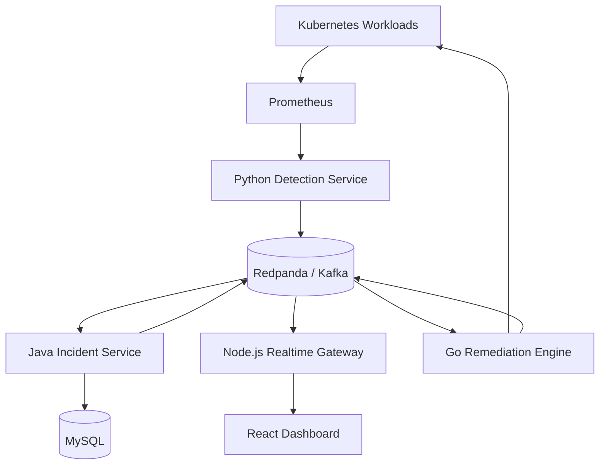

# AegisOps System Architecture

## Purpose

AegisOps is an event-driven reliability platform for Kubernetes workloads.
This document separates what is **currently implemented** from the
**target architecture** the project is being built toward, so a reader can
tell the two apart at a glance.

## Implementation Status

| Component | Status | Notes |
|---|---|---|
| Go cluster agent | Complete | CrashLoopBackOff detection only |
| Java incident service | Complete | REST API, MySQL persistence, transactional outbox |
| MySQL persistence | Complete | `incidents` and `incident_outbox_events` tables |
| Kafka event publishing | Complete | Single topic, two event types |
| Node.js realtime gateway | Complete | Kafka consumer, WebSocket broadcast |
| React dashboard | Planned (next) | Not started; see the reconciliation model below |
| Acknowledge / resolve endpoints | Planned | Status changes currently go through one generic `PATCH` |
| Remediation request endpoint | Planned | No remediation engine exists yet |
| Services endpoint | Planned | No `services` table exists yet |
| Python detection service | Planned | No Prometheus integration yet |
| Go remediation engine | Planned | No automated or approved remediation exists yet |
| Prometheus / Grafana | Planned | No metrics collection exists yet |
| Retry topics / dead-letter topics | Planned | Only direct at-least-once delivery exists today |
| Distributed tracing | Planned | No trace propagation exists yet |
| Helm / Terraform / AWS deployment | Planned | Local Docker Compose only today |

---

## Current System

Everything in this section describes code that exists and runs today.

### Implemented Event Flow

```text
Kubernetes workload failure
    -> Go cluster agent
        -> Java incident service REST API
            -> MySQL incidents and transactional outbox
                -> Kafka topic aegisops.incident.events.v1
                    -> Node.js realtime gateway
                        -> WebSocket clients
```

The React dashboard is the next planned component and is **not yet
implemented**. There is currently no consumer of the realtime gateway's
WebSocket stream.

### Current Components

| Component | Technology | Responsibility | Port |
|---|---|---|---:|
| Cluster agent | Go | Detects `CrashLoopBackOff` and reports incidents | n/a (in-cluster watcher) |
| Incident service | Java 21, Spring Boot 4 | Incident lifecycle, REST API, persistence, event publishing | 8080 |
| Realtime gateway | Node.js 22, Fastify, WebSockets | Consumes Kafka, broadcasts to WebSocket clients | 8081 |
| Database | MySQL 8.4 | Incident and outbox storage | 3306 (mapped to 3307 locally) |
| Event broker | Apache Kafka | Incident event transport | 9092 |

### Current REST API

Owned by the incident service (see
`services/incident-service/README.md`):

| Method | Endpoint | Purpose |
|---|---|---|
| `POST` | `/api/v1/incidents` | Create an incident |
| `GET` | `/api/v1/incidents` | List incidents |
| `GET` | `/api/v1/incidents/{incidentId}` | Retrieve an incident |
| `PATCH` | `/api/v1/incidents/{incidentId}/status` | Update incident status |
| `GET` | `/actuator/health` | Service health check |

The realtime gateway exposes:

| Endpoint | Protocol | Purpose |
|---|---|---|
| `/ws/incidents` | WebSocket | Incident lifecycle event stream |
| `/health` | HTTP | Service health check |

#### Planned REST additions (not implemented)

These do not exist in `IncidentController` today. Status changes currently
go through the single `PATCH /api/v1/incidents/{incidentId}/status`
endpoint above.

| Method | Endpoint | Purpose |
|---|---|---|
| `POST` | `/api/v1/incidents/{id}/acknowledge` | Dedicated acknowledge action |
| `POST` | `/api/v1/incidents/{id}/resolve` | Dedicated resolve action |
| `POST` | `/api/v1/incidents/{id}/remediations` | Request remediation |
| `GET` | `/api/v1/services` | List monitored services |

### Current Event Contract

Topic: `aegisops.incident.events.v1`

The incident ID is the Kafka message key, which preserves ordering for a
given incident within a partition.

Current event types:

- `INCIDENT_CREATED`
- `INCIDENT_STATUS_CHANGED`

The current schema (version `1`) is flat. Every event contains exactly:

- `eventId`
- `eventType`
- `eventVersion`
- `occurredAt`
- `incidentId`
- `serviceName`
- `severity`
- `status`
- `previousStatus`

There is no `correlationId`, no `source`, and no nested `payload` in the
current schema. The event does **not** carry `title`, `description`,
`createdAt`, or `updatedAt` — see the dashboard reconciliation model below.

### Current Persistence

Verified against the Flyway migrations in
`services/incident-service/src/main/resources/db/migration`. Only two
tables exist today:

| Table | Purpose |
|---|---|
| `incidents` | Incident records (id, service name, title, description, severity, status, timestamps) |
| `incident_outbox_events` | Transactional outbox: pending/published events awaiting Kafka delivery |

`services`, `incident_events`, `remediation_actions`, and `audit_logs` are
**not** current tables. Only the incident service accesses MySQL directly.

### Current Reliability Behavior

- Incident writes and their outbox event are committed in the same MySQL
  transaction (the transactional outbox pattern).
- Kafka delivery is at-least-once: a scheduled publisher retries any event
  still `PENDING`, so the same event can be published more than once.
- The incident ID is used as the Kafka message key.
- The realtime gateway validates every incoming Kafka message against the
  version-1 schema and silently drops anything invalid.
- Because delivery is at-least-once, any consumer of the event stream must
  deduplicate using `eventId`.
- Health endpoints exist for the incident service (`/actuator/health`) and
  the realtime gateway (`/health`). The cluster agent has no HTTP endpoint;
  it is a background watcher.

#### Planned reliability work (not implemented)

- Retry topics and dead-letter topics for events that repeatedly fail to
  publish or process.
- Distributed tracing across HTTP and Kafka boundaries.
- Remediation approval policies, bounded retries, and timeouts.
- Immutable audit records for remediation attempts.

### Dashboard Reconciliation Model (Intended)

The current event schema is intentionally compact and does not carry the
full incident record. Once the dashboard exists, it is expected to
reconcile state as follows:

1. Load the initial incident snapshot from `GET /api/v1/incidents`.
2. Receive compact incident notifications over WebSocket.
3. Deduplicate using `eventId`.
4. Retrieve the complete incident using
   `GET /api/v1/incidents/{incidentId}`.
5. Upsert the complete REST representation into dashboard state.

This round-trip is necessary because the current event does not contain
`title`, `description`, `createdAt`, or `updatedAt` — only the REST
representation does.

---

## Target Architecture (Roadmap)

Everything below describes where the project is heading, not what exists
today. Components and behavior in this section are not implemented unless
also listed under **Current System** above.

### MVP Scenario

1. A Kubernetes workload becomes unhealthy.
2. Prometheus records abnormal metrics.
3. The detection service identifies the anomaly.
4. An incident is created and displayed on the dashboard.
5. An operator approves a remediation action.
6. The remediation engine restarts, scales or rolls back the workload.
7. The result is recorded in the incident audit trail.

### Target System Overview



### Target Components

| Component | Technology | Responsibility | Port |
|---|---|---|---:|
| Dashboard | React and TypeScript | Incident visualization and operator controls | 5173 |
| Incident service | Java and Spring Boot | Incident lifecycle, REST API and persistence | 8080 |
| Realtime gateway | Node.js and WebSockets | Push event updates to connected dashboards | 8081 |
| Detection service | Python and FastAPI | Analyze metrics and publish anomalies | 8000 |
| Remediation engine | Go | Execute approved Kubernetes recovery actions | 8082 |
| Event broker | Redpanda/Kafka | Reliable asynchronous communication | 9092 |
| Database | MySQL | Incident and remediation history | 3306 |
| Metrics | Prometheus | Collect workload and platform metrics | 9090 |
| Visualization | Grafana | Infrastructure and application monitoring | 3000 |

### Target Kafka Topics

Only `aegisops.incident.events.v1` (see **Current Event Contract** above)
is implemented today. The remaining topics require services that do not
exist yet.

| Topic | Producer | Consumers | Purpose |
|---|---|---|---|
| `aegisops.anomaly.detected.v1` | Detection service | Incident service | Report detected failures |
| `aegisops.incident.events.v1` | Incident service | Realtime gateway | Publish incident changes |
| `aegisops.remediation.requested.v1` | Incident service | Remediation engine | Request approved recovery |
| `aegisops.remediation.completed.v1` | Remediation engine | Incident service | Report remediation results |

The target envelope for future event types (anomaly and remediation
events) is intended to include `correlationId`, `source`, and a nested
`payload`, unlike the current flat incident-event schema.

### Target Data Ownership

Only the incident service will access MySQL directly. Planned tables, in
addition to the two that already exist:

- `services`
- `remediation_actions`
- `audit_logs`

A dedicated `incident_events` table is not currently planned as separate
storage; event history instead flows through the outbox and Kafka.

### Target Security Guardrails

Mostly concerned with the not-yet-built remediation engine:

- Automatic remediation is disabled by default.
- Operators must approve remediation during the MVP.
- The remediation engine receives minimum Kubernetes RBAC permissions.
- AWS authentication will use short-lived credentials.
- Every remediation attempt creates an immutable audit record.
- Destructive actions require an explicit allow-listed policy.

One guardrail already applies today, independent of remediation: secrets
never enter source control (verified for this repository — see
`.gitignore`).

### Implementation Order

1. Incident service and MySQL — **done**
2. Kafka event contracts and Redpanda — **done** (single topic)
3. Realtime gateway and dashboard — realtime gateway **done**, dashboard
   **planned next**
4. Remediation engine and Kubernetes integration — planned
5. Detection service and Prometheus — planned
6. Observability and distributed tracing — planned
7. Kubernetes and Helm deployment — planned
8. Terraform and AWS deployment — planned
9. CI/CD, security scanning and load testing — CI exists per-service today;
   security scanning and load testing are planned
