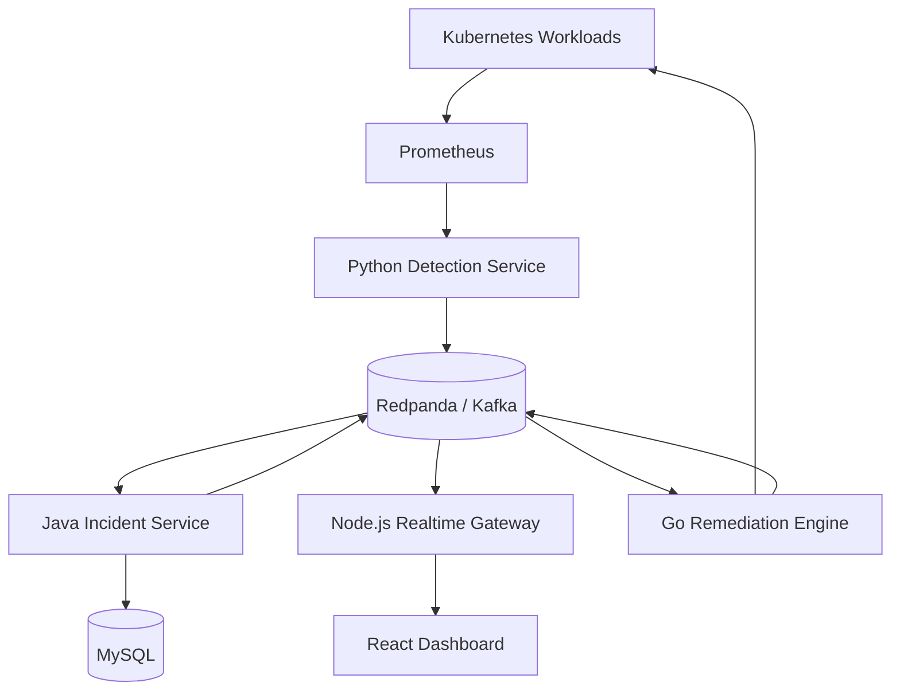

# AegisOps System Architecture

## Purpose

AegisOps is an event-driven reliability platform that detects failures in Kubernetes workloads, creates incidents, streams live updates and executes controlled remediation actions.

## MVP Scenario

1. A Kubernetes workload becomes unhealthy.
2. Prometheus records abnormal metrics.
3. The detection service identifies the anomaly.
4. An incident is created and displayed on the dashboard.
5. An operator approves a remediation action.
6. The remediation engine restarts, scales or rolls back the workload.
7. The result is recorded in the incident audit trail.

## System Overview

## Components

| Component | Technology | Responsibility | Port |
|---|---|---|---:|
| Dashboard | React and TypeScript | Incident visualization and operator controls | 5173 |
| Incident service | Java and Spring Boot | Incident lifecycle, REST API and persistence | 8080 |
| Realtime gateway | Node.js and WebSockets | Push event updates to connected dashboards | 8081 |
| Detection service | Python and FastAPI | Analyze metrics and publish anomalies | 8000 |
| Remediation engine | Go | Execute approved Kubernetes recovery actions | 8082 |
| Event broker | Redpanda/Kafka | Reliable asynchronous communication | 9092 |
| Database | MySQL | Incident and remediation history | 3306 |
| Metrics | Prometheus | Collect workload and platform metrics | 9090 |
| Visualization | Grafana | Infrastructure and application monitoring | 3000 |

## Kafka Topics

| Topic | Producer | Consumers | Purpose |
|---|---|---|---|
| `aegisops.anomaly.detected.v1` | Detection service | Incident service | Report detected failures |
| `aegisops.incident.lifecycle.v1` | Incident service | Realtime gateway | Publish incident changes |
| `aegisops.remediation.requested.v1` | Incident service | Remediation engine | Request approved recovery |
| `aegisops.remediation.completed.v1` | Remediation engine | Incident service | Report remediation results |

Every event will include:

- `eventId`
- `eventType`
- `eventVersion`
- `occurredAt`
- `correlationId`
- `source`
- `payload`

## REST API Boundary

The incident service owns the public API:

| Method | Endpoint | Purpose |
|---|---|---|
| `GET` | `/api/v1/incidents` | List incidents |
| `GET` | `/api/v1/incidents/{id}` | Retrieve an incident |
| `POST` | `/api/v1/incidents/{id}/acknowledge` | Acknowledge an incident |
| `POST` | `/api/v1/incidents/{id}/resolve` | Resolve an incident |
| `POST` | `/api/v1/incidents/{id}/remediations` | Request remediation |
| `GET` | `/api/v1/services` | List monitored services |
| `GET` | `/actuator/health` | Service health check |

The realtime gateway exposes:

- `/ws/incidents` for incident lifecycle updates.
- `/health` for service health checks.

## Data Ownership

Only the incident service accesses MySQL directly.

Initial database tables:

- `services`
- `incidents`
- `incident_events`
- `remediation_actions`
- `audit_logs`

Other services communicate through REST APIs or Kafka events.

## Reliability Rules

- Kafka delivery is treated as at least once.
- Consumers must be idempotent using `eventId`.
- Failed events use retry topics and dead-letter topics.
- Every remediation request includes a correlation ID.
- Remediation operations have timeouts and bounded retries.
- Health endpoints are available for every service.
- Distributed traces propagate across HTTP and Kafka boundaries.

## Security Guardrails

- Automatic remediation is disabled by default.
- Operators must approve remediation during the MVP.
- The remediation engine receives minimum Kubernetes RBAC permissions.
- Secrets never enter source control.
- AWS authentication will use short-lived credentials.
- Every remediation attempt creates an immutable audit record.
- Destructive actions require an explicit allow-listed policy.

## Implementation Order

1. Incident service and MySQL
2. Kafka event contracts and Redpanda
3. Realtime gateway and dashboard
4. Remediation engine and Kubernetes integration
5. Detection service and Prometheus
6. Observability and distributed tracing
7. Kubernetes and Helm deployment
8. Terraform and AWS deployment
9. CI/CD, security scanning and load testing
